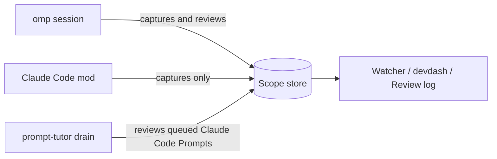

# prompt-tutor

Review the English of every interactive prompt you send to omp or type into Claude Code, out of band. prompt-tutor never edits your Prompt or adds tutor feedback to the agent's conversation.

## Demo

No GIF is included: a fixture-only VHS recording has not yet been made.

## What you get

- **Reviews:** spelling, grammar, and fluency findings, a same-register rewrite, and one transferable tip.
- **Watcher:** a colourful terminal view of the latest Review and recent Prompts, with links to the full local Review log.
- **Digest:** a weekly, per-Scope HTML lesson about recurring patterns, with counts, examples, trends, and a focus paragraph.

A static Digest screenshot is not included yet; this repository has no rendered fixture Digest to capture.

## Requirements

- The latest omp release. Claude Code Prompts are also reviewed by omp, so omp is needed even if you only use Claude Code.
- Bun 1.3 or newer (`curl -fsSL https://bun.sh/install | bash`). omp's plugin manager, the Watcher, and the Claude Code mod all run on it.
- Optional: Claude Code 2.1.287 or later, to review the Prompts you type there.
- Optional: [devdash](https://github.com/shayan-ys/devdash), to show the latest Review in a dashboard.

## How the pieces fit



omp reviews its own Prompts in the background. The Claude Code mod only queues Prompts; `prompt-tutor drain` reviews them with omp's models while you keep it running.

## Set up

Follow these steps in order on a new computer. Steps 5 and 6 are only for Claude Code, and step 7 is only for devdash.

**1. Give omp working models in every omp profile you use.** prompt-tutor grades with each profile's `@task` model role and writes Digests with its `@advisor` role, using that profile's own provider login. Log in once per profile, for example:

```sh
omp login
omp --profile personal login
```

Claude Code Prompts are graded by omp too, so a Claude sign-in alone is not enough.

**2. Install the omp plugin in every omp profile you use.** For the default profile:

```sh
omp plugin install github:shayan-ys/prompt-tutor
```

For each named profile, for example `personal`:

```sh
omp --profile personal plugin install github:shayan-ys/prompt-tutor
```

**3. Put the `prompt-tutor` command on your `PATH`.** The command links into a directory that must already be on your `PATH`. A new Mac has none for your user, so create `~/.local/bin` and add it (zsh shown):

```sh
mkdir -p ~/.local/bin
echo 'export PATH="$HOME/.local/bin:$PATH"' >> ~/.zshrc
```

Open a new terminal and start omp from it, so omp sees the new `PATH`. Then run this inside omp in the profile you use most:

```text
/prompt-tutor install-watcher
```

This symlinks the installed command into `~/.local/bin`. To use another directory that is already on `PATH`, pass it, for example `/prompt-tutor install-watcher ~/bin`. The command prints the link path. Check it in a new shell:

```sh
prompt-tutor --once
```

**4. Write your config** at `~/.config/prompt-tutor/config.yml` (see [Configuration](#configuration)). Without a file, everything goes to one `default` Scope. For Claude Code, give each Scope a `review_profile`, or its Claude Code Prompts stay queued.

**5. Install the Claude Code mod.** `prompt-tutor` and Bun must be on the `PATH` that Claude Code runs with (step 3).

```sh
claude plugin marketplace add shayan-ys/prompt-tutor
claude plugin install prompt-tutor@prompt-tutor
```

From a local clone, use `claude plugin marketplace add /path/to/prompt-tutor` instead of the first command. Restart any open Claude Code session: mods load when a session starts.

**6. Start the Drainer in its own terminal tab** and leave it running while you use Claude Code:

```sh
prompt-tutor drain
```

It prints one line per omp profile it starts, such as `draining personal: personal`. It is a long-running command, so it does not fit a devdash section; give it a terminal tab or pane of its own. Prompts you type while it is stopped wait in the queue. See [The Drainer](#the-drainer).

**7. Add prompt-tutor to devdash.** Install devdash by following [its README](https://github.com/shayan-ys/devdash#install), then add this to `~/.config/devdash/config.toml`:

```toml
[[integrations]]
name = "prompt-tutor"
title = "PROMPT TUTOR"
command = ["prompt-tutor", "--once"]
position = "bottom"
max_rows = 100
watch = ["~/.local/share/prompt-tutor", "~/.config/prompt-tutor"]
keys = { j = "newer", k = "older", s = "scope" }
```

If devdash shows `⚠ cannot run prompt-tutor`, use the full path of the link, for example `command = ["~/.local/bin/prompt-tutor", "--once"]`. Without devdash, run `prompt-tutor` in a terminal tab for the full Watcher.

**8. Check it works.**

- In omp, send a Prompt with a mistake, such as `she dont know where is the file`. The footer chip shows `EN …`, then the Finding counts, and the Watcher shows the Review.
- In Claude Code, send the same Prompt. The Watcher shows it as `queued` while no Drainer runs for its Scope, and as a Review a few seconds after `prompt-tutor drain` picks it up.

## Usage

Type Prompts normally in omp. Reviews run in the background and the footer chip updates when the newest Review settles. For the full Watcher, start a terminal tab and run:

```sh
prompt-tutor
```

The Watcher reads local records and Review logs; it does not write them. The first interactive omp session after Friday noon may build a stale weekly Digest in the background.

### Claude Code

The Claude Code mod only captures each Prompt. It makes no model call and adds nothing to Claude's context. It captures only Prompts you type in the Claude Code composer; Remote Control, `claude -p`, the Agent SDK, `/loop`, schedules, and other plugins are not captured. If your organization turns mods off, captures stop without a message.

### The Drainer

There is one Drainer per Scope: a second `prompt-tutor drain` skips Scopes that are already being drained. It starts one headless omp process for each `review_profile` in your config and reviews the queued Prompts of that profile's Scopes, so prompt-tutor must be installed in every omp profile that a `review_profile` names. If a profile's omp has not started draining after 30 seconds, the command prints a warning. The startup lines (`draining <profile>: <scopes>`, `already draining …`) go to stdout; per-Prompt progress goes to stderr as `[<profile>] prompt-tutor drain: …`. Press Ctrl-C to stop it; Prompts that are not yet reviewed stay queued. The Watcher shows a Claude Code Prompt as queued while no Drainer is running for its Scope.

The command reads your config once, when it starts. Changes to a Scope that an already running profile drains are picked up. If you add a Scope with a new `review_profile`, restart `prompt-tutor drain`. After you upgrade prompt-tutor, restart it too.

If it prints `already draining … (pid N, <path>)` and pid N is not a prompt-tutor Drainer (the pid was reused after a crash or reboot), delete the `drain.lock` file at that path and run it again.

### Dashboards

`prompt-tutor --once` prints one frame and exits. It fits the `COLUMNS` it is given, is as tall as its content (the host scrolls it), and leaves out the Watcher's key row. With `DEVDASH_STATE_FILE` set, `DEVDASH_ACTION` accepts `newer` (`j`/up), `older` (`k`/down), and `scope` (`s`); the state file preserves the view and selected Prompt between runs. The frame includes the Watcher's view tabs and follow indicator. Without a state file, any action is ignored and nothing is written. See the [devdash prompt-tutor example](https://github.com/shayan-ys/devdash#example-prompt-tutor).

## Configuration

Configuration is YAML at `$XDG_CONFIG_HOME/prompt-tutor/config.yml` (normally `~/.config/prompt-tutor/config.yml`). The first matching Scope wins; conditions in one `when` entry are ANDed, and entries are ORed. This routes the `personal` profile or work under `~/Documents/personal/` to the personal store, with everything else in work:

```yaml
keep_months: 2
explanation_language: Spanish
scopes:
  - name: personal
    when:
      - profile: personal
      - cwd: ~/Documents/personal/**
    review_profile: personal
  - name: work
    review_profile: work
```

`review_profile` is optional and has no default. It names the only omp profile whose Drainer may review that Scope's Claude Code Prompts, and so which provider receives them. Prompt-tutor does not derive it from `when`, because a wrong guess would send a Prompt to the wrong provider. Without it, a Scope's Claude Code Prompts stay queued. The unnamed omp profile is `default`.

`keep_months` is optional; absent or `null` keeps all Review log months. When set, it must be an integer of at least 2 and retains the current local month plus that many months before it. `explanation_language` is optional, defaults to English, and sets the language of explanations—not the target language, which remains English. With no config file, prompt-tutor uses one `default` Scope and keeps all months. Each Scope stores its Prompt records, Review log, and Digest in its own directory. A Claude Code Prompt has the profile name `claude-code` and its session's working directory, so `cwd` conditions work as for omp and `profile: claude-code` targets Claude Code Prompts. See [ADR 0007](./docs/adr/0007-digest-runs-in-scope-profile.md) for Digest routing and [ADR 0011](./docs/adr/0011-claude-code-adapter-as-mod.md) for Claude Code review.

## Privacy

1. **Provider exposure:** each omp Prompt's text is sent to the session profile's `@task` model for its Review (ADR 0008). Each Claude Code Prompt's text is sent to the `@task` model of its Scope's `review_profile` (ADR 0011); Claude Code and your Claude account receive nothing extra from prompt-tutor. Each week's Findings, with the sentences they came from, are sent to the Scope's Digest profile's `@advisor` model (ADR 0007). Scope selection does not change which provider receives a Prompt; the reviewing profile's `@task` setting does.
2. **Storage:** by default, each Scope's files are under `$XDG_DATA_HOME/prompt-tutor/<scope>/` (normally `~/.local/share/prompt-tutor/<scope>/`); a configured `store` may choose another path. With two or more Scopes, the all-Scopes Review log is stored at `$XDG_DATA_HOME/prompt-tutor/all/log/` unless `all_scopes_log` overrides it. Files are written with mode `0600`. Prompt records contain only preprocessed text: `<system-reminder>` blocks that Claude Code adds are removed, a leading slash token is removed, and fenced code is replaced with `[code]`. `keep_months` optionally prunes old Review log months; `prompt-tutor --delete-data` lists the known data paths, and adding `--yes` removes them.
3. **Scope separation:** Scopes keep work and personal Prompt records, Review logs, and Digests apart. They do not isolate or change providers. `explanation_language` changes only the language of explanations, not what is sent.

## Upgrade

Upgrade each omp profile separately:

```sh
omp --profile <p> plugin upgrade prompt-tutor
```

For the default profile, omit `--profile <p>`. Users track `main`; SemVer tags are optional pins, not the normal upgrade route.

Update the Claude Code mod:

```sh
claude plugin marketplace update prompt-tutor
claude plugin update prompt-tutor@prompt-tutor
```

Then restart omp, Claude Code, and `prompt-tutor drain`.

## Uninstall

Stop every writer first: close all Claude Code sessions, then remove the Claude Code plugin, so no Prompt is captured while data is removed:

```sh
claude plugin uninstall prompt-tutor@prompt-tutor
claude plugin marketplace remove prompt-tutor
```

Then stop `prompt-tutor drain` and quit all omp sessions. Before removing the Watcher command or plugin, review the data-removal dry run:

```sh
prompt-tutor --delete-data
```

If you want to remove the listed data, run:

```sh
prompt-tutor --delete-data --yes
```

This removes only known prompt-tutor paths for the current config. Unknown files are left in place and reported; the config file is never deleted. If a Scope was renamed or removed from the config, its old store is not discovered by this command.

Next, remove the Watcher link at the path printed by `install-watcher`, only if it is a symlink into a prompt-tutor installation. Do not use `rm "$(command -v prompt-tutor)"`, which may select a different executable. Finally, uninstall from every profile:

```sh
omp --profile <p> plugin uninstall prompt-tutor
```

For the default profile, omit `--profile <p>`.

## How it works

See the [glossary](./GLOSSARY.md) and the architecture decisions: [per-Prompt storage](./docs/adr/0001-per-prompt-json-files.md), [just-in-time Digest](./docs/adr/0002-just-in-time-digest.md), [role-based grading](./docs/adr/0003-grader-via-advisor-role.md), [model-written Digest](./docs/adr/0004-digest-written-by-advisor.md), [installing from main](./docs/adr/0005-install-from-main.md), [Review log rebuilds](./docs/adr/0006-review-log-rebuilt-not-appended.md), [Digest profile routing](./docs/adr/0007-digest-runs-in-scope-profile.md), [grading with `@task`](./docs/adr/0008-grader-via-task-role.md), [retention and data deletion](./docs/adr/0009-retention-by-log-month.md), [English target with localized explanations](./docs/adr/0010-english-target-explanation-language.md), and [Claude Code capture and the Drainer](./docs/adr/0011-claude-code-adapter-as-mod.md).

## Contributing

See [CONTRIBUTING.md](./CONTRIBUTING.md).

## License

[MIT](./LICENSE).
